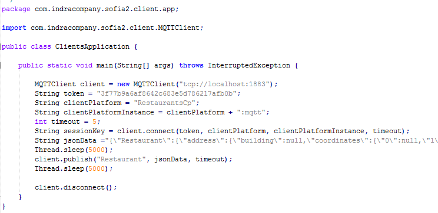

Java Client Library:
============================


## Compile and use the library:

To use this library you need to:
1. Compile the platform, this generates en your local Maven Repository: \com\indracompany\sofia2\sofia2-ssap\5.0.0-SNAPSHOT\sofia2-ssap-5.0.0-SNAPSHOT.jar
2. Compile the client library, this generates \com\indracompany\sofia2\sofia2-java-clients\5.0.0-SNAPSHOT\sofia2-java-clients-5.0.0-SNAPSHOT.jar
3.   Add following dependency to your project:
```
<dependency>
	<groupId>com.indracompany.sofia2</groupId>
	<artifactId>sofia2-java-clients</artifactId>
	<version>${sofia2.version}</version>
</dependency>
```


## MQTT Example

MQTTClient allows your application to connect and send data to the IoT Broker, using MQTT as the transport protocol.

To use this client:
 

-  Import com.indracompany.sofia2.client.MQTTClient
-  Create new client, specifying URI of the MQTT server, 
   example: new MQTTClient("tcp://localhost:1883");
-  To connect client to Broker, you need to call method "connect()" with aguments: token, device identification, device instance identification, and timeout for waiting broker response (in seconds). 
   example: client.connect("3f77b9a6af8642c683e5d786217afb0b", "RestaurantsCp", "RestaurantsCp:mqtt", 5); 
-  You can publish messages through method "publish()", arguments needed: ontology identification name, ontology instance as string (must be json format!), and timeout in seconds.
-  To terminate the connection, call method "disconnect()" ex. client.disconnect();