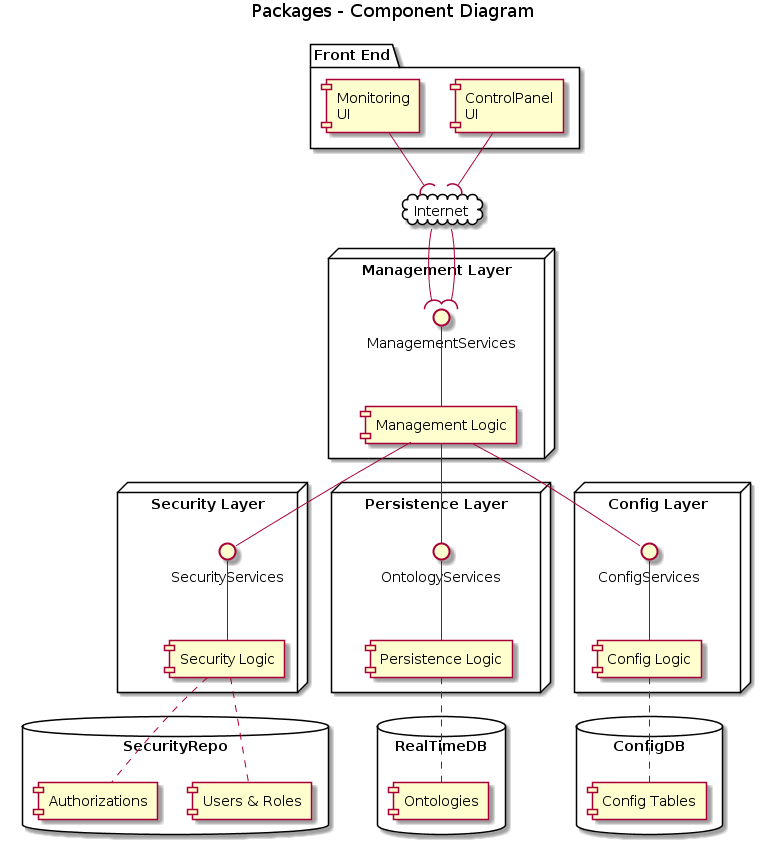

Sofia4Cities Architecture
============================

This section shows fundamental concepts behind Sofia4Cities architecture and logical design.

Sofia4Cities IoT platform consists of the following modules (executable elements):

- IoT Broker
- API Manager
- Router Engine
- Flow Engine
- Scripting Engine
- Control Panel
- Monitoring UI
- Device Simulator Engine
- Twitter Streaming Module

These modules uses others components of the platform as:

- Common Components
- Services: Mail, Twitter, Cache, ...
- Config Components
- Persistence Components
- Security Components
- Communication Components

## Components Diagram for IoT Flow
This diagram show the main components involved in the IoT Flow of the platform.
 
The flow is resolved by these modules:

- IoTBroker: is the module on the adquisition layer, it receives a message/event from systems and devices in one of the protocols supported, validates the message, checks if device has access to send this message (by SecurityServices), finds configuration for the message in the ConfigDB (by ConfigServices), triggers the engines necessary to solve the flow (StreamingServices) and finally stores the message in the RealTimeDB (by OntologyServices).
- APIManager: is the module on the publication layer, typically receives a REST request from a external system (app, web,...) or user (SwaggerUI), checks permission of the APIKey (by SecurityServices), finds configuration for this request (by ConfigServices), triggers the engines (StreamingServices) and query  (or store in) the RealTimeDB (by OntologyServices).
- FlowEngine: this module allows to create visual flows that are executed (1) when IoTBroker or APIManager receives a request or (2) planned. It uses Node-red as base technology and offers components to interoperate with the platform and other systems.

## Components Diagram for Management Flow
This high-level diagram show the main components involved in the management of the platform:
 
As you can see there are two management UIs:

- ControlPanel: for the visual management of all elements of the platform (devices, rules, flows, ontologies, dashboards,...)
- Monitoring UI: monitorice all the executable modules, showing if they are active, CPU and memory use, metrics,...

## Ports and  Context Paths of the modules

In this table you can see the default ports and contextpaths of the deployables modules of the platform (you can configure it as you want):

MODULE | PORT | CONTEXT PATH 
------ | ---- | --------
ControlPanel | 18080 | /controlpanel
Dashboard Engine | 18100 | /dashboard-engine
IoTBroker | 18100 | /iotbroker /iotbroker/swagger-ui.html
DeviceSimulator | 18110 | /devicesimulator
APIManager | 18200 | /api-manager
FlowEngine | 18300 | /flowengine
MonitoringUI | 19000 | /

## High Availability & Horizontal Scaling

For the purpose of horizontal scaling, in Sofia4Cities all instances of the components will function concurrently.
To support **high availability (HA)** of the platform you need a set of machines, VMs or container-runtime-platform that have:

- An HTTPBalancer and a TCPBalancer
- An IoTBroker cluster with at least 2 nodes (machines, VMs or containers)
- An APIManager cluster with at least 2 nodes
- A StreamingEngine cluster with at least 2 nodes
- A Management Cluster with at least 2 nodes
- A RealTimeDB Cluster with at least 3 nodes
- A ConfigDB Cluster with at least 2 nodes

(Obviously if you use containers you´ll deploy each module as a container, if you use machines or VMs you can share machines or VMs to deploy modules).

## Third-party components

The platform use and is based in these components:

- Eclipse Moquette as embedded MQTT Broker
- JSON-Schema as reference implementation for ontologies
- NGINX as default HTTP balancer 
- HAProxy as TCP/MQTT balancer
- Spring as glue framework for all development
- Spring Boot for Spring apps deployment
- Spring Boot for development and deployment
- Thymeleaf for Control Panel UI development
- Hazelcast for internode communication
- MongoDB as default RealTimeDB (although you can use another databases as Cassandra, HBase, MemSQL,...)
- A SQL Database for storing all configuration of the platform
- Docker for containerization
- ...
