Getting Started Guide
============================

In this guide we are using "Sofia4Cities CloudLab", this is a free installation of the platform offered in Cloud in which developers and potential users of the platform can probe the platform.

##Access CloudLab
The main access to use "Sofia4Cities CloudLab" is
[https://rancher.sofia4cities.com/controlpanel/login](https://rancher.sofia4cities.com/controlpanel). 

First of all you have to create a User, in order to do that plwase on the login page select **New Account** and enter id, password, name and mail for accesing the platform. If you want to accces the platform as a developer you should select **Developer** user role.
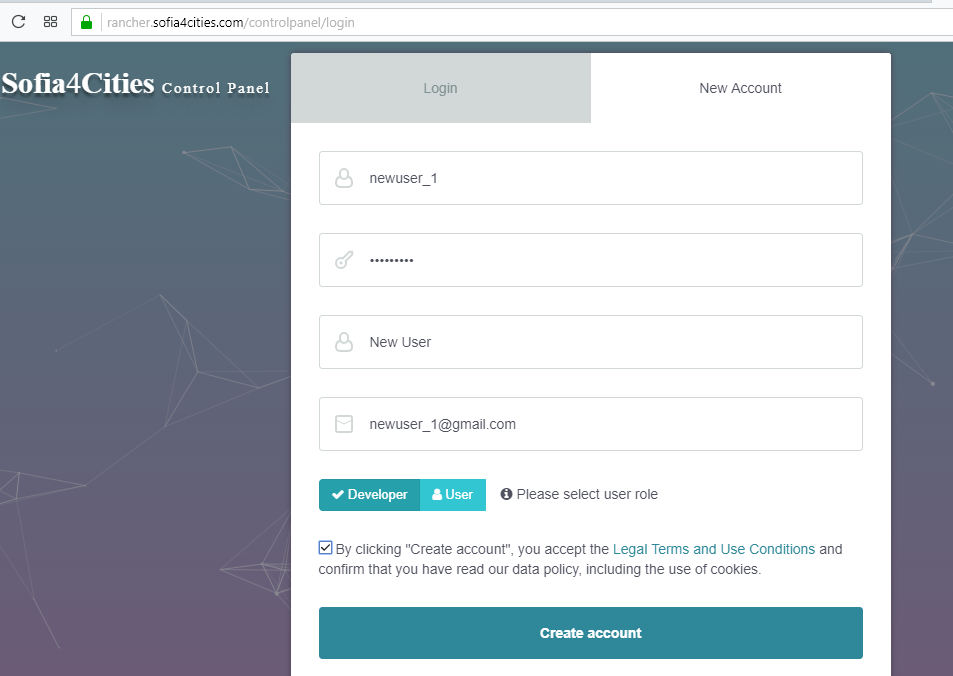

Once you have created the account you can access with your user and password:
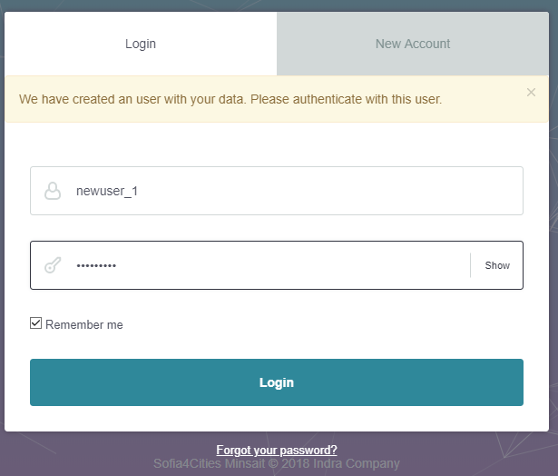

## Main Page
When you access the ControlPanel with **developer role** you´ll see a page like this:
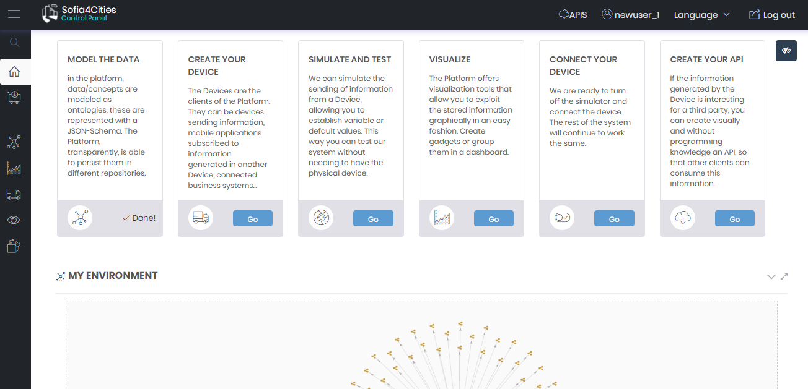
The main page show you:
* A menu in the left side with all the options of the platform organized in submenus: SHARE&USE, DEVELOPMENT, VISUALIZATION, DEVICES, DIGITAL TWIN and TOOLS.
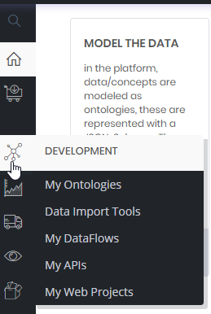
* A header in which you can view your token, access your profile, select the language of the application and log out of the system:

* a first widget that shows you the typical flow for creating apps with the platform, each box explain the action of it.
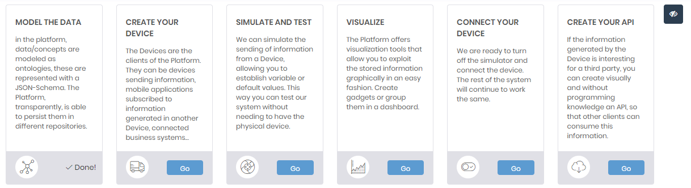
* a second widget showing a graph of the components of the user. As some users have created public ontologies you can access them:
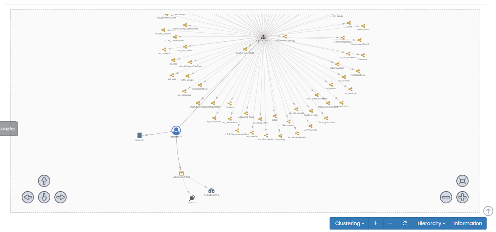

## Creating an Ontology

The first step it to model the data that we want to use.
To do that, go to the menú option **DEVELOPMENT -> My Ontologies .

This option shows the available ontologies.
Use the **Create** option at the right upper corner to create a new *Ontology*.

An *Ontology* represents the data model of your data.

Complete the following information for your new *Ontology*:
:

- Name: provide a unique name of the *Ontology*. For example Temperature_newuser_1
- Meta-Information: insert keywords to classify *Ontologies*. Use commas to introduce several keywords.
- Active: indicate if the *Ontology* is active. It is not possible to use inactive *Ontologies*.
- Public: indicate if the *Ontology* is public. All users will be able to query the data stored in the public *Ontologies*.
- Description: provide a description that helps identify the goal of the *Ontology*.
- Ontology Template: select one of the available templates to create the ontology. The most basic template is **General -> EmptyBase**. 
After selecting the template, add all the properties that you need in the ontology using the **ADD NEW PROPERTY** button.

When you finish of adding properties use the **UPDATE SCHEMA** to add all the new properties to the *Ontology*. This shows the internal schema of the ontology (the platform validates all messages of this type with this schema)
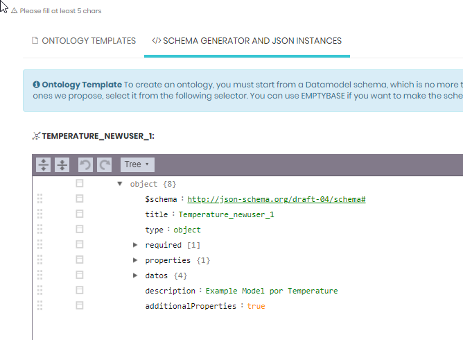

Finally, you save the *Ontology* using the **New** Button at the end of the page.
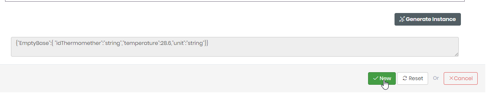

## Creating a Device for the ontology

After defining the ontology it is possible to define **Devices** that work with the ontology.
A *Device* is the representation of a physical device or system connected to the platform.
These *Devices* will generate or consume data.
To do that, go to the *DEVICES -> Devices Templates* menu option. 
Use the **Create** button placed in the right upper corner to define a new *Device*.

Complete the following information for the new *Device*: 

- Identification: provide a unique name for the *Device*. For example **Thermometer_newuser_1**
- Description: add a description for the *Device*.
- Ontologies: it is possible to configure access to several ontologies. In this case we select the previously created ontology *Temperature_newuser_1*
  - Ontology: ontology identification.
  - Access Level: the type of access configured.
- Meta Information: Additional information about the device. The information will be added as key values pairs.
  - name: the name of the key.
  - value: the value of the property.

Now you can save your Device with **New** button. In the list of Devices you can view:
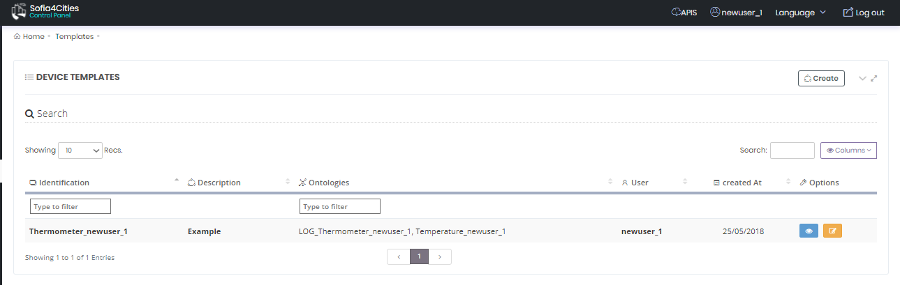


## Creating a Simulator for the device

It is possible de define Device Simulators, this concept simulates a device sending information (Ontology instances) to the platform.
To do that, go to the **DEVICES -> Devices Simulator* *** menu option and use the **Create** button placed in the right upper corner to define a new *Device Simulator*. 

Complete the following information for the new *Device Simulator*:
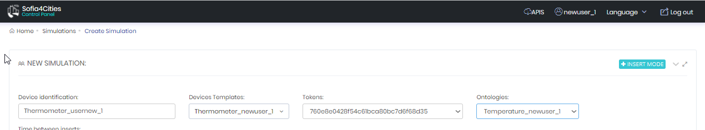

- Device Identification: Choose a unique name for the *Device Simulator*. For example ** **Thermometer_usernew_1**
- Device Template: choose the available **Device Thermometer_newuser_1* *
- Token: choose one of the tokens defined in the *Device*.
- Ontology: choose one of the ontologies in which the device has insert authorization. In this case **Temperature_newuser_1**

- Time between inserts: indicate the time in seconds between each insert in the ontology. For example 3
- Ontology Properties: fulfil the information required to generate values for each field of the ontology.


Finally, it is necessary to save the simulator by using the **New** button.
When you have created the simulator automatically it starts to generate data as you can see in the list:
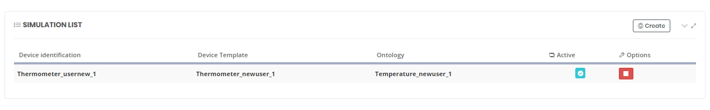

The *Control Panel* web application register the simulation task. 
When For executing the simulation it is necessary to start the application device-simulator.

To do that, go to S:\sources\sofia2-s4c\modules\device-simulator and execute:

```sh
mvn spring-boot:run
```

You can see that the simulator insert data using the **TOOLS -> Database Query Tools**.

### Creating a Dashboard

### Creating an API REST

It is possible to publish operations over your *Ontologies* using creating APIs REST.

To use the created APIs, it is necessary to start up a new service called *API Manager*.
Execute S:\start.bat, go to S:\sources\sofia2-s4c\modules\api-manager and run:

```sh
mvn spring-boot:run
```

After the *API Manager* server starts go back to the *Control Panel* web application and use the *API MANAGER -> APIs Definition* menu option.  
Once this is done, use the **Create** button.

You have to provide several information to create the API: 

- Identification: select a unique name for your API.
- API type: currently only expose an *Ontology* as API REST is available.
- Ontology: choose the *Ontology* used in the API.
- Description: provide a description for the API.
- Category: choose the category that better match your API.
- Public: if marked, this API will be visible for all the users and all the user will be able to use it.
- Meta-inf: provide the meta information that you want for your API.
- Image: if you want to use an image for the representation of your API.
- Operations: then you have to choose the operations that you want to expose in your API. There are several pre created operations. Additionally, you can provide any other operation based on queries.
  - QUERY(ID): if selected, it allows to use get data by id operation from the *Ontology*.
  - INSERT: if selected, it allows to perform insert operations to the *Ontology*.
  - UPDATE: if selected, it allows to perform update operations to the *Ontology*.
  - DELETE(ID): if selected, it allows to perform delete operations by the id of the data stored in the *Ontology*.
  - QUERY CUSTOM: this option allows to define all the required operations that could be required based on database queries. For example, the next query with SQLLIKE syntax will return all the data from an *Ontology* named *<ontology_name>*: 

  ```SQL
  select * from <ontology_name>
  ```

  Finally, use the **Edit** button to save the API data.

  The next step is to create an *API Manager Token*. These tokens are used to authorize the REST operations. 

  To test the API you can use the integrated *swagger* client.
  Go to the *API MANAGER -> APIs Definition* menu option, and use the **SWAGGER** option of the API that you want to test.
  This opens a form with all the operations of the API.
  You have to provide valid parameters for the operations and in the **X-SOFIA2-APIKey** you have to provide a valid *API Token* generated as it is explained above.

  The same test can be done with an external REST client, for instance Postman.
  This is done by including in the header of the HTTP requests one parameter with key **X-SOFIA2-APIKey** and the token as value.