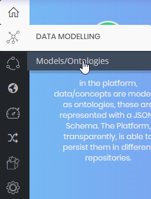

# Getting Started Guide

## Installing the Development Environment

[See documentation](../how-to-execute-devenv/README.md)

## Downloading the Source Code

[See documentation](../how-to-execute-devenv/README.md)

## Compiling the Project

[See documentation](../how-to-execute-devenv/README.md)

## Integration with Eclipse IDE

[See documentation](../how-to-execute-devenv/README.md)

## Running the Platform

[See documentation](../how-to-execute-devenv/README.md)

## Basic Usage of the Platform

After performing the previous steps, you are ready to start using the platform.

The main access to use the platform is
[http://localhost:18080/controlpanel/](http://localhost:18080/controlpanel/). 
This will load the login form to access to the platform.

Within the installation, some users are created by default. 
You are free to change them or to create more users.

Please, use **administrator** login and **changeIt!** password to go into the platform with administrator role.

### Creating an Ontology
The first step it to model the data that we want to use.
To do that, go to the *DATA MODELLING -> Models / Ontologies* menu option .

This option shows the available ontologies.
Use the **Create** option at the right upper corner to create a new *Ontology*.
An *Ontology* represents the data model of your data.

Complete the following information for your new *Ontology*:

- Name: provide a unique name of the *Ontology*.
- Meta-Information: insert keywords to classify *Ontologies*. Use commas to introduce several keywords.
- Active: indicate if the *Ontology* is active. It is not possible to use inactive *Ontologies*.
- Public: indicate if the *Ontology* is public. All users will be able to query the data stored in the public *Ontologies*.
- Description: provide a description that helps identify the goal of the *Ontology*.
- Ontology Template: select one of the available templates to create the ontology. The most basic template is **General -> EmptyBase**. After selecting the template, add all the properties that you need in the ontology using the **ADD NEW PROPERTY** button. When you finish of adding properties use the **UPDATE SCHEMA** to add all the new properties to the *Ontology*. Finally, you can save the *Ontology* using the **New** Button at the end of the page.

### Creating a Device

After defining the ontology it is possible to define *Devices* that work with the ontology.
A *Device* is the representation of a physical device into the platform.
These *Devices* will generate or consume data.
To do that, go to the *DEVICES -> Definition of Devices* menu option.
Use the **Create** button placed in the right upper corner to define a new *Device*.

Complete the following information for the new *Device*:

- Identification: provide a unique name for the *Device*.
- Description: add a description for the *Device*.
- Ontologies: it is possible to configure access to several ontologies.
  - Ontology: ontology identification.
  - Access Level: the type of access configured.
- Meta Information: Additional information about the device. The information will be added as key values pairs.
  - name: the name of the key.
  - value: the value of the property.

### Creating a Simulator

It is possible de define simulators for the device to help test the ontology and to generate data to aid in development.
To do that, go to the *DEVICES -> Devices Simulator* menu option and use the **Create** button placed in the right upper corner to define a new *Device Simulator*.

Complete the following information for the new *Device Simulator*:

- Identification: Choose a unique name for the *Device Simulator*.
- Device: choose one of the available *Devices*.
- Token: choose one of the tokens defined in the *Device*.
- Ontology: choose one of the ontologies in which the device has insert authorization.
- Time between inserts: indicate the time in seconds between each insert in the ontology.
- Ontology Properties: fulfil the information required to generate values for each field of the ontology.

Finally, it is necessary to save the simulator by using the **New** button.

### Creating a Dashboard

### Creating an API

It is possible to publish operations over your *Ontologies* using creating APIs REST.
To do that, go to 
